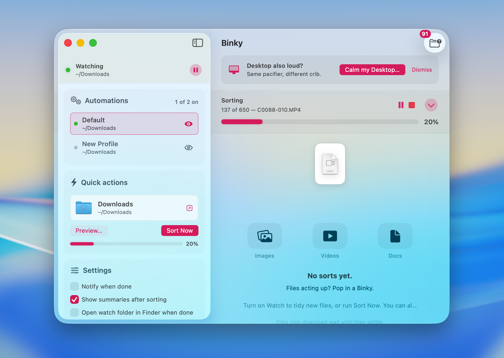
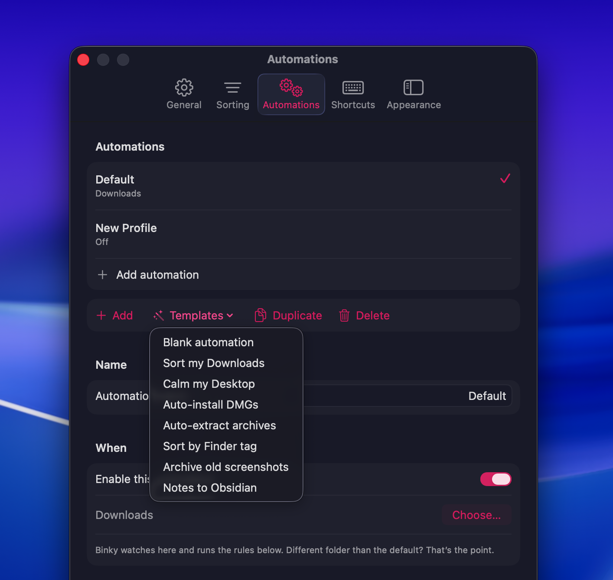
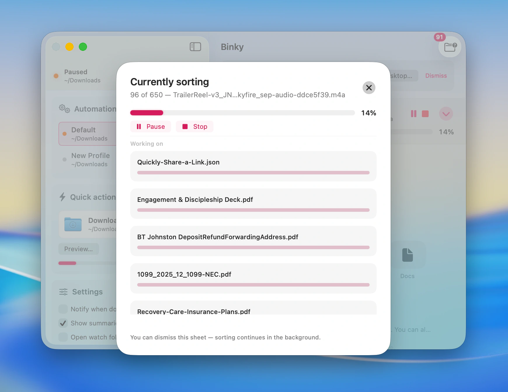
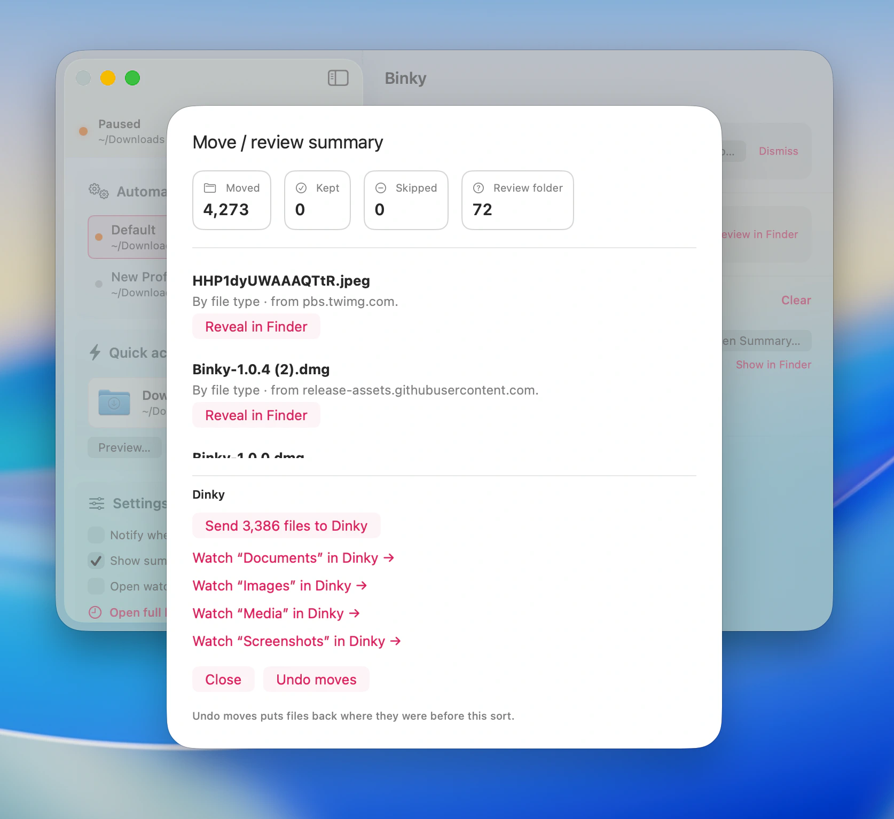

# Binky

A native macOS app that calms whatever folder is fussy — Downloads, Desktop, a Dropbox inbox, a screenshots dump, you name it. **Automations** are named, parallel workflows: each can watch its own source, run its own rules, and optional Finder tags. The default global inbox still points at `~/Downloads` if you like it there.

Binky waits for files to finish landing, then routes them into clear sorted folders — Images, PDFs, Media, Documents, Archives, Apps, Screenshots, and Misc — or runs the action you chose (extract an archive, install from a DMG, fan out by Finder tag, and more).

Unknown or sketchy extensions do not disappear silently: they land in **Review** first. Optional Finder tags, move summaries, and session history make it easy to verify what happened and undo where possible.

**Requires macOS 14 Sonoma or later** (Liquid Glass UI on macOS 26 Tahoe).

<table>
  <tr>
    <td></td>
    <td></td>
  </tr>
  <tr>
    <td></td>
    <td></td>
  </tr>
</table>

## Releases

**1.x** is organizer-first: sort now, watch continuously, review uncertain files, and keep a reliable history of move outcomes.

**Homebrew:** add this repo as a tap once, then install the cask (see [Casks/README.md](Casks/README.md) for why it lives in-tree):

```bash
brew tap heyderekj/binky https://github.com/heyderekj/binky
brew install --cask binky
```

You can also download `Binky-{version}.dmg` or `Binky-{version}.zip` from [GitHub Releases](https://github.com/heyderekj/binky/releases).

## About the developer

Hey! I'm [Derek Castelli](https://www.heyderekj.com), a full-time freelance web designer working primarily in Webflow and Figma. Binky came from a boring problem: Downloads gets noisy fast, and manually dragging files around all day is not the dream.

## Features

- **Sort Downloads Now** - one-click sort with stable-file checks and collision-safe moves
- **Automations** - multiple named watchers (each with its own source folder and rules) plus a global inbox fallback
- **Watch** - monitor folders continuously and route new files as they settle
- **Rules** - extensions, names, origins, OCR/receipt hints, Finder tag predicates, actions (move, zip, extract, DMG install, tag fan-out, trash, rename)
- **Review folder** — unknown or ambiguous extensions get held for inspection first
- **History and undo-friendly flow** - batch summaries with moved, skipped, and review counts
- **Finder Quick Action and Services** - run "Sort with Binky" on selected files
- **Apple Shortcuts support** - "Sort Files" App Intent can hand paths to Binky
- **Finder tags (optional)** - apply tags during routing for quick visual scanning
- **Launch at login** - keep it ready in the background when your Mac boots
- **Native macOS stack** - SwiftUI + AppKit, no bundled web runtime

## What others don't do

- **Treat uncertainty safely** - questionable files go to **Review** instead of being buried in the wrong folder
- **Sort with context, not just extension lists** - automations and routing logic keep behavior consistent across different workflows
- **Keep a readable paper trail** - clear per-batch outcomes so you can verify what moved and what did not
- **Fit native Mac workflows** - Finder Services, Shortcuts, and login-item support out of the box
- **Stay lightweight** - organizer-first UX on Apple frameworks with strict bundle-size discipline

## Why it exists

Downloads is where good naming conventions go to die. Binky exists to make that mess quiet again without adding another noisy "productivity system."

Fussy inbox. Meet Binky.

## How it works

Binky is built in Swift and SwiftUI with AppKit integration for Mac-native behavior. The organizer pipeline waits for files to stabilize, classifies by routing rules, then moves them safely to target sorted folders with review safeguards.

The app keeps session outcomes so you can see exactly what happened in each run. Optional compatibility code from earlier compression-focused iterations may remain in the bundle, but the shipping product and UX are organizer-led.

## Built with

- SwiftUI
- AppKit
- Foundation
- UserNotifications
- Xcode project + native macOS frameworks only

## Install

Download the latest release and drag `Binky.app` to Applications.

Or install with Homebrew:

```bash
brew tap heyderekj/binky https://github.com/heyderekj/binky
brew install --cask binky
```

**Gatekeeper:** if macOS blocks the first launch, use **System Settings → Privacy & Security → Open Anyway**, or run:

```bash
xattr -dr com.apple.quarantine /Applications/Binky.app
```

For local development:

```bash
xcodebuild -scheme Binky -configuration Debug test -destination 'platform=macOS'
```

## FAQ

**macOS says Binky can't be opened — what do I do?**

That's Gatekeeper. Use **System Settings → Privacy & Security → Open Anyway**, or remove the quarantine flag with the `xattr` command in [Install](#install) above.

**Is it actually free?**

[Open source on GitHub](https://github.com/heyderekj/binky) under MIT. Free.

**Does Binky upload my files?**

No. Sorting stays on your Mac. No accounts baked in.

**Mac only? Which macOS?**

Yes. SwiftUI, native frameworks, no cross-platform runtime. Requires macOS 14 Sonoma or later. On macOS 26 Tahoe, the UI uses Liquid Glass where available.

**Does it move originals or make copies?**

Moves originals. Nothing duplicated, nothing left behind in Downloads. That's why the stable-file gate and the Review folder exist — Binky won't touch a file it isn't sure about.

**What if Binky isn't running when files land?**

The watch folder only acts while Binky is running. Files that arrived while it was off sit untouched — run Sort Now when you're ready and it'll sweep them up.

**Can I set custom routing rules?**

Yep. Match by name, extension, kind, size, or date — then route to any folder you choose. Good for sending client files to client folders, project exports to project folders, receipts to wherever receipts go. Rules can also rename on the way and add Finder tags. They run before the default sorted folders.

**What file types go in which destination?**

Images (jpg, png, gif, webp, svg, heic…), PDFs, Media (mp4, mov, mp3, m4a…), Documents (doc, txt, md, xls…), Archives (zip, rar, 7z, tar…), Apps (dmg, pkg, app), Screenshots (matched by name pattern), Misc (everything else). Unknowns or ambiguous types go to Review.
