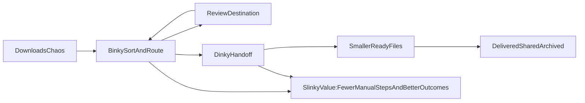

# Slinky Single-Bundle Strategy

## Objective

Define `Slinky` as one paid plan that unlocks pro workflow features across both apps:

- `Binky` for calm inbox organization
- `Dinky` for compression and delivery-ready output

This doc keeps core utility free, then layers paid value on automation depth, confidence, and cross-app flow.

## Current Baseline (From Existing Product Language)

- Binky core promise: calm a noisy Downloads inbox with stable-file checks, sensible routing, review safety, and history.
- Binky current free positioning already emphasizes "quiet handling" over productivity theater.
- Binky Help already includes a Dinky bridge: "Send to Dinky" and "Watch ... in Dinky" handoff paths.
- Existing paid brainstorms favor depth features (rule intelligence, diagnostics, automation), not gating basic sorting.
- Code already has a tier scaffold (`free` / `plus`) that can be remapped to `free` / `slinky`.

## 1) Positioning Statement

**One-liner**

Slinky is the paid workflow layer for Dinky + Binky: sort first, slim second, done without babysitting.

**Expanded**

Binky already calms Downloads. Dinky already makes files lighter. Slinky connects both into one pro lane for people who process lots of files every week and are tired of repeat cleanup decisions. Free stays useful and complete for basic daily use; Slinky removes repetitive steps, adds smarter routing/compression controls, and gives better visibility into what happened and why.

## 2) Audience and Jobs-To-Be-Done

## Primary users

- Solo creatives and freelancers (designers, video editors, content creators)
- Operators and assistants managing shared asset handoffs
- Anyone with recurring high-volume Download -> organize -> deliver loops

## Core jobs

- "When files pile up, route them fast without losing trust in outcomes."
- "When delivery size matters, compress with predictable quality defaults."
- "When I repeat the same cleanup every day, automate it once."

## Pain sequence (today)

1. Downloads gets noisy.
2. Manual triage steals focus.
3. Compression is another separate pass.
4. Delivery/archival still needs naming and checking.

Slinky targets steps 2-4.

## 3) Bundle Packaging Model (Single Plan)

## Model

- One Slinky entitlement unlocks paid features in both Binky and Dinky.
- User can still run either app independently.
- Value increases when used together, but purchase is not split by app.

## Principles

- Keep the "calm inbox" and "basic compression" paths free.
- Gate depth, not essentials.
- Reward cross-app usage with convenience features that are hard to replicate manually.

## Naming and entitlement direction

- Product-facing plan name: `Slinky`.
- Current technical stub (`free` / `plus`) can later migrate to `free` / `slinky` naming.
- Keep entitlement architecture app-agnostic so one license works in both apps.

## 4) Feature Boundaries and Matrix

## Binky (organize)

**Free**

- Sort now + watch folder behavior
- Starter destinations and review safety path
- Profiles/rules basics, history, undo-friendly outcomes
- Finder Services/Quick Action and Shortcuts intent

**Slinky**

- Advanced rule predicates (source app, richer metadata conditions, regex)
- Rule templates/packs and import/export bundles
- Rule diagnostics ("why this matched") and conflict simulator
- Profile stacks and schedule-aware profile switching
- Review Assistant (bulk decisions with confidence hints)
- Versioned rule sets with rollback + sandbox test mode

## Dinky (compress)

**Free**

- Core image/video/PDF compression workflows
- Manual file/folder handoff and watch-folder basics
- Smart defaults for common formats

**Slinky**

- Automation presets tuned for recurring output targets (delivery/social/archive)
- Deeper batch policies (priority handling, post-compress action chains)
- Higher-confidence diagnostics ("why this setting was chosen")
- Preset export/import and team-sharing packs
- Cross-folder watch orchestration for multi-step pipelines

## Both together (cross-app value)

**Free**

- Existing handoff entry points (send files to Dinky, watch in Dinky)

**Slinky**

- Linked workflow recipes: Binky route -> Dinky compress -> destination action
- Shared profile/preset packs that map sorting + compression together
- Unified weekly workflow reports (sorted counts, compressed counts, time saved)
- One-click "optimize this route" suggestions based on history trends

## 4.1) Paid Upgrades Framed by Use Case

Frame paid value around concrete outcomes, not long feature menus.

## Use case 1: "My Downloads folder explodes every day"

Best fit: Binky-focused upgrades.

- Smart Rules Pack (Binky): richer match conditions, regex presets, and rule debugging.
- Review Pack (Binky): bulk review actions, confidence hints, and safer unknown-file triage.
- Profiles Pack (Binky): profile stacks, schedule-based switching, and profile portability.
- Reporting Pack (Binky): weekly sorting summaries and source-of-clutter insights.

Outcome: less manual triage and fewer routing mistakes.

## Use case 2: "I need smaller files fast without babysitting exports"

Best fit: Dinky-focused upgrades.

- Preset Pro Pack (Dinky): export-target presets (client delivery, web/social, archival).
- Batch Control Pack (Dinky): smarter queue controls, batch priority, and post-compress chains.
- Diagnostic Pack (Dinky): "why this quality/codec" explanations and warning insights.
- Preset Portability Pack (Dinky): import/export/share presets across Macs or teammates.

Outcome: repeatable compression results with fewer re-exports.

## Use case 3: "I do both: sort first, then compress, every day"

Best fit: cross-app upgrades that connect Dinky and Binky.

- Flow Recipes Pack (Both): one-click route -> compress -> destination action workflows.
- Shared Packs (Both): linked Binky routing profiles + Dinky compression presets.
- Workflow Insights Pack (Both): cross-app reporting (sorted, compressed, and time saved).
- Optimization Suggestions Pack (Both): recommendations based on repeated history patterns.

Outcome: one clean path from messy Downloads to delivery-ready files.

## 5) Cross-App Workflow Loops

## 6) Pricing and Licensing Model (Major-Version License)

Use one Slinky bundle across both apps, sold as a one-time license for a full major release line.

## Recommended model

- Buy once for the current major series (example: buy `Slinky 2`, receive all `2.x` updates).
- A new license is only required for the next whole-number release (`3.0`, `4.0`, etc.).
- Existing license holders receive a discounted major-upgrade price.

## Upgrade policy shape

- New purchase: full major-version price.
- Upgrade purchase: loyalty discount for prior-major owners (target 30-40% off).
- Grace period: buyers within 60-90 days before a major launch receive that major upgrade free.

## Why this model fits

- Matches Mac utility buying behavior ("own this version").
- Keeps pricing simple and easy to explain.
- Rewards loyalty without forcing subscriptions.
- Supports meaningful major-release launches with clear value jumps.

## Pricing placeholders (to validate later)

- New major license: `$12-$15` target range.
- Upgrade license: `$5-$7` target range.
- Launch promo (optional): `$9-$12` during the initial launch window.

## Current preferred starting point

- `Slinky 1.x`: `$12`
- Upgrade to next major: `$6`
- Grace period: 90 days (recent buyers get next major free)

## Pricing philosophy

Keep Slinky priced like a small functional Mac utility: low-friction, easy to try, and easy to justify without a long decision cycle. The goal is broad adoption and trust first, then steady major-version upgrades from real product improvements, not aggressive monetization.

These are working placeholders for planning, not final prices.

## 7) Rollout Roadmap

## Phase 1 — Foundation (naming + entitlement + messaging)

- Standardize "Slinky" language in marketing and in-app upgrade surfaces.
- Keep backend/entitlement mapping compatible with current `plus` stub while implementing major-version license checks.
- Add clear free-vs-Slinky value copy in settings/help surfaces.
- Define and publish upgrade policy copy (major version scope, upgrade discount, grace period).
- Complete Apple distribution compliance: paid Apple Developer account, Developer ID signing, hardened runtime, and notarization for release builds.

## Phase 2 — First paid value slice (2-3 high-clarity wins)

- Ship Binky rule diagnostics/conflict simulator.
- Ship Binky profile stacks or schedule-aware switching.
- Ship one cross-app recipe flow (route -> compress -> post-action).

## Phase 3 — Workflow depth and insights

- Add pack import/export (rules + presets).
- Add weekly workflow report + optimization suggestions.
- Add advanced orchestration options for high-volume users.

## 8) Risks and Guardrails

## Risks

- Over-gating free features can weaken trust and adoption.
- Cross-app complexity can increase setup friction.
- Messaging may become vague if "automation" claims are not concrete.

## Guardrails

- Never paywall core calm-inbox utility or basic compression outcomes.
- Keep Slinky prompts contextual, short, and skippable.
- Every paid feature should map to a repeated manual step it removes.
- Keep copy dry, warm, and plain-spoken; avoid generic productivity language.

## 9) Launch Copy Starters

Use as rough options for site, in-app nudges, and onboarding.

1. One plan. Two calmer apps.
2. Sort it. Slim it. Ship it.
3. Binky handled the mess. Dinky handled the weight.
4. Slinky ties the whole loop together.
5. Your Downloads had a tantrum. Slinky packed snacks.
6. Less dragging files around. More done.
7. Route first. Compress second. Repeat never.
8. Pop in Slinky. Let the fuss settle.
9. For people whose Downloads never stay quiet.
10. Binky and Dinky, now in one pro lane.
11. The paid plan for fewer manual file chores.
12. Set the flow once. Let it run.
13. Fewer clicks between "downloaded" and "delivered."
14. Calm inbox. Lean files. Same afternoon.
15. Slinky: the bridge between tidy and tiny.

## Success Criteria

- Clear reason for Slinky to exist as one bundle.
- Explicit free-vs-paid boundaries for both apps.
- Actionable first release slice for implementation planning.
- Voice remains consistent with Binky's calm, dry tone.

